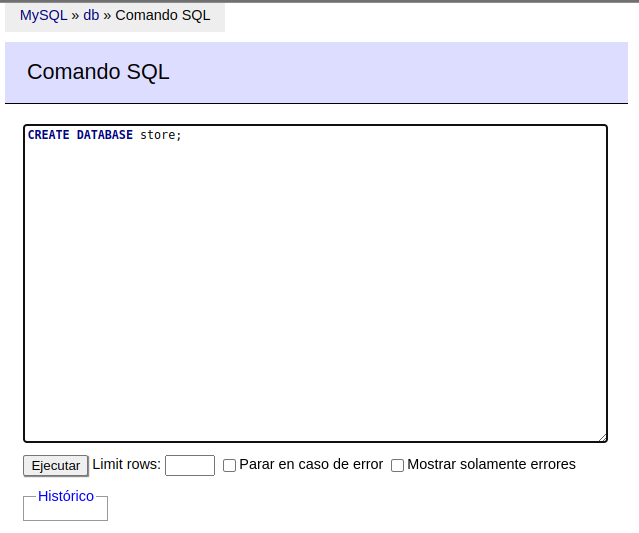
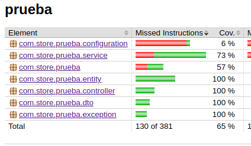

# Evaluacion Falabella
Para correr localmente, se necesita la base de datos. Por lo cual es necesario ejecutar el siguiente comando en la raiz del proyecto

```
docker-compose up -d
```

* El -d, significa __detached__

## Configurar la base de datos

Si es la primera vez que ejecuta, debe crear la base de datos con los siguientes pasos

* Acceder a url http://localhost:8081/ 
```
Usuario: root
Clave: example
```

* Ejecute comando de creacion base de datos en la ventana de 'Comando SQL', tal como se muestra en la imagen a continuacion:

Comando:
```
CREATE DATABASE store;
```
Imagen ejemplo:



## Construir y ejecutar la aplicacion

* Para construir y ejecutar la applicacion es necesario ingresar a la carpeta del proyecto y ejecutar los siguientes comandos

Linux - OSX:

* Construccion
```
./gradlew clean build
```
* Ejecucion
```
cd build/libs/
java -jar prueba-0.0.1-SNAPSHOT.jar
```

Window:
* Construccion
```
gradlew.bat clean build
```
* Ejecucion
```
cd build/libs/
java -jar prueba-0.0.1-SNAPSHOT.jar
```

### Generar reporte de coverura de test
Para generar el reporte de covertura de test es necesario ejecutar el siguiente comando

* Linux / OSX
```
./gradlew build jacocoTestReport
```
* Windows
```
gradlew.bat build jacocoTestReport
```

Al finalzar la ejecucion el reporte de covertura queda almacenado en el directorio: ```/build/jacocoHtml/index.html```




## Probar CRUD de Productos

A continuacion se explicara como consumir los servicios de creacion, modificacion, busqueda y eliminacion de productos, a traves de CURL 

* #### Crear un nuevo producto (sku: FAL-234567654)
```
curl --location --request POST 'http://localhost:8080/products/create' \
--header 'Content-Type: application/json' \
--data-raw '{
    "sku": "FAL-234567654",
    "name": "Polera",
    "brand": "Adidas",
    "size": "XXL",
    "primaryImage": "http://polera.png",
    "otherImages": [
        "http://img1.png",
        "http://img2.png",
        "http://img3.png",
        "http://img4.png",
        "http://img5.png"
    ]
}'
```

* #### Consultar todos los productos

```
curl --location --request GET 'http://localhost:8080/products'
```

* #### Consultar un producto por SKU FAL-234567654

```
curl --location --request GET 'http://localhost:8080/products/FAL-234567654'
```

* #### Actualizar un producto por SKU FAL-234567654

```
curl --location --request PUT 'http://localhost:8080/products/update/FAL-234567654' \
--header 'Content-Type: application/json' \
--data-raw '{
    "sku": "FAL-234567654",
    "name": "Pantalon",
    "brand": "Adidas",
    "size": "XXL",
    "price": 0,
    "primaryImage": "http://polera.png"
}'
```

* #### Eliminar un producto por SKU FAL-234567654

```
curl --location --request DELETE 'http://localhost:8080/products/delete/FAL-234567654'
```